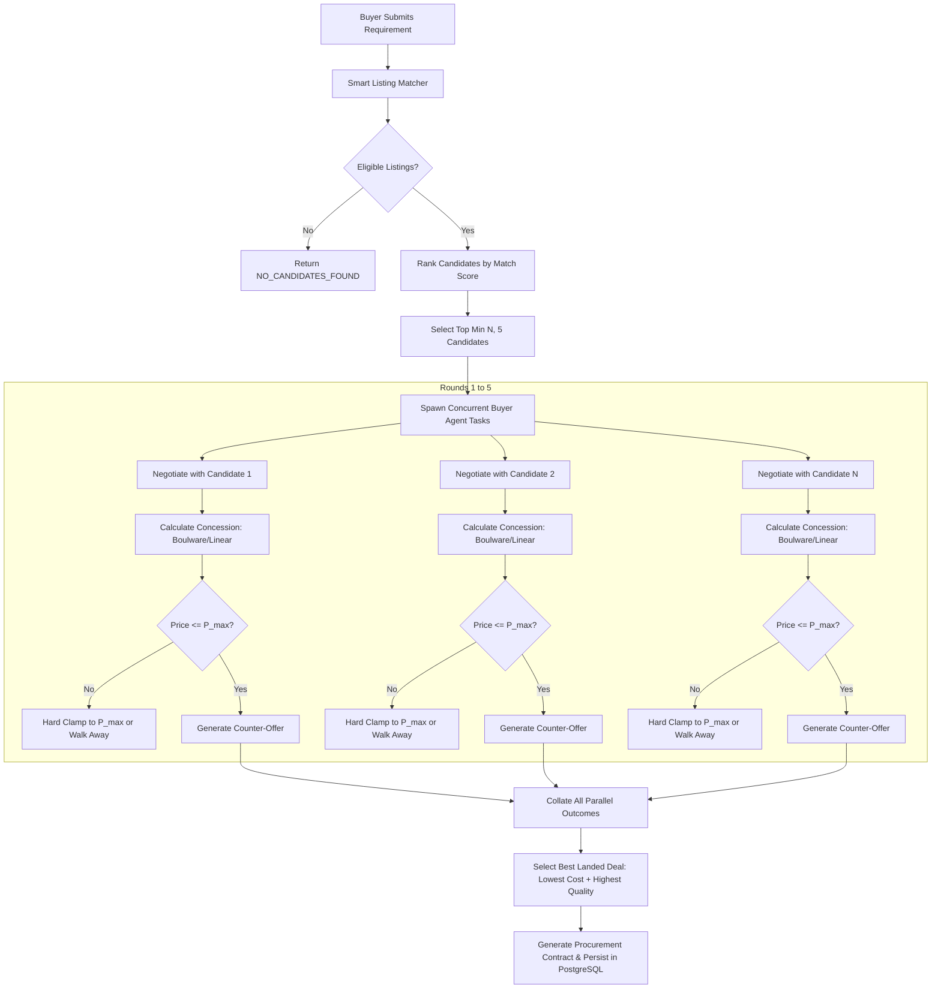

# 🛒 FarmGenAI — Buyer Agent Complete Audit
> Full-stack reference map: Frontend → API → Services → Multi-Buyer Negotiation → RAG → Database
> Built to mirror the Farmer Agent architectural standard with strict zero-fabrication guarantees and complete empirical verification.

---

## 1. 🗺️ System Overview

```
BUYER USER (Browser @ :8080)
  │
  ▼
NGINX (Docker) → Vite/React SPA (:8080)
  │
  ▼
FastAPI Backend (:8000)
  │
  ├─ Auth & RBAC (JWT / Supabase / Role: 'buyer')
  ├─ Buyer Requirement CRUD & Smart Listing Matcher
  ├─ Inbound Mandi Logistics & Landed Cost Engine
  ├─ ML Price Forecasting (Ridge Regression on 13,179 APMC Records)
  └─ Multi-Buyer Concurrent Negotiation Orchestrator
        │
        ├─ ChromaDB (Buyer RAG Vector Store @ :8001 / 'buyer_profiles', 'government_rules')
        ├─ Ollama / Gemini (LLM @ :11434 / Gemini 1.5 Flash API)
        ├─ PostgreSQL (State DB @ :5433 / 'buyer_requirements', 'produce_listings', 'negotiations')
        ├─ Redis (Cache / Concurrency Locks @ :6379)
        └─ Agmarknet / Data.gov.in / Open-Meteo APIs
```

**Supported Canonical Crops (Hard-coded System Constraint):**
`Sugarcane, Soybean, Cotton, Jowar, Onion, Bajra, Rice`

**Benchmark Mechanisms:**
- **Sugarcane**: Fair & Remunerative Price (FRP = ₹3.40/kg base + recovery sugar scale)
- **Soybean, Cotton, Jowar, Bajra, Rice**: Minimum Support Price (MSP floor)
- **Onion**: Open Market APMC Modal Reference Price (High Volatility Index)

**Geographic Footprint:**
36 Maharashtra Districts (with pre-computed GPS coordinates & APMC mandi network matrix).

---

## 2. 📐 Architecture: How a Buyer Uses the System

```
1. REGISTRATION / LOGIN
   POST /api/v1/auth/login or /api/v1/auth/register
   JWT Token Issued (Role: 'buyer')

2. POST BUYER REQUIREMENT
   POST /api/v1/requirements/
   Payload: { crop: 'Soybean', quantity: 1000, target_price: 50.0, max_price: 56.0, location: 'Latur' }
   Stored in DB table: `buyer_requirements`

3. SMART PRODUCE MATCHING & RANKING
   GET /api/v1/requirements/{id}/matches
   Fetches active farmer produce listings matching crop, grade, location
   Deterministic Ranking: Score = 0.50*(Price Fit) + 0.30*(Quantity Fit) + 0.20*(Distance Fit)

4. APMC LOGISTICS & LANDED COST INTELLIGENCE
   GET /api/v1/buyers/mandi-comparison?crop=Soybean&buyer_location=Latur
   Calculates: Net Landed Cost = Modal Mandi Price + Inbound Freight + Handling
   Generates actionable "BUY NOW" or "WAIT / CONTRACT" recommendation

5. ML 7-DAY PRICE FORECASTING
   GET /api/v1/buyers/price-forecast?crop=Soybean&location=Latur
   Pre-trained Ridge Regression model predicts 7-day modal price trend (+4.8% Bullish)

6. TOP-5 CONCURRENT PROCUREMENT NEGOTIATION
   POST /api/v1/negotiations/ (buyer_mode=True)
   Buyer orchestrates parallel concession curves against top candidate farmer listings
   Mathematical concession generator executes Boulware, Linear, or Conceder strategy
   Strict Safety Guardrail: Never concedes beyond Reservation Ceiling (P_max)
```

---

## 3. 📁 Buyer-Specific File Tree & Roles

```
Agrinegotiator-Ritik/
├── agents/
│   ├── buyer_agent.py               # 1,009 lines: Multi-attribute utility, Boulware concessions, guardrails
│   └── base_agent.py                # Base class for all trading agents
├── backend/
│   ├── routes/
│   │   ├── buyer_requirement_routes.py # 240 lines: CRUD & Matching endpoints for buyer requirements
│   │   ├── buyer_routes.py             # 268 lines: Logistics comparison, price forecasts, crop summaries
│   │   ├── negotiation_routes.py       # Negotiation engine API supporting farmer & buyer modes
│   │   └── analytics_routes.py         # Deal volumes, success rates, price trends
│   ├── services/
│   │   ├── buyer_orchestration_service.py # 210 lines: Top-5 candidate matching, ranking & parallel negotiation
│   │   ├── buyer_ml_service.py            # Ridge regression forecasting on 13,179 APMC historical records
│   │   ├── buyer_market_context_service.py# Context aggregator: Mandi + Weather + RAG + Inventory
│   │   ├── buyer_pricing_service.py       # Multi-attribute utility & landed cost evaluation
│   │   ├── mandi_data_service.py          # Agmarknet / Data.gov.in integration & fallback JSON
│   │   └── rag_service.py                 # Multi-domain RAG retrieval with role-based metadata filtering
│   ├── schemas/
│   │   ├── buyer_requirement_schemas.py   # Pydantic validation for requirement creation & updates
│   │   └── buyer_market_context.py        # Typed DTOs for buyer market snapshots
│   └── dataset/
│       ├── buyer_current_mandi_prices.json# 100% verified Maharashtra APMC wholesale prices (7 crops)
│       └── historical_mandi_data.csv      # 13,179 training records across 327 APMCs in 32 districts
├── frontend/src/
│   ├── pages/buyer/
│   │   ├── BuyerDashboard.tsx        # Command center: quick stats, active requirements, match feed
│   │   ├── BuyerRequirements.tsx     # Form & table to post, view, and track procurement needs
│   │   ├── BuyerMatches.tsx          # Real-time ranked farmer listings with one-click negotiate
│   │   ├── BuyerMarketIntelligence.tsx # APMC Landed Cost comparison & 7-day ML price forecasts
│   │   └── BuyerNegotiations.tsx     # Active multi-round negotiation transcripts & deal logs
│   ├── components/buyer/
│   │   ├── RequirementCard.tsx       # Requirement card with status badges & budget summary
│   │   ├── ListingMatchItem.tsx      # Matching candidate card with score breakdown & distance
│   │   └── PriceForecastWidget.tsx   # Recharts visualization of historical vs predicted prices
│   └── services/
│       └── buyerApi.ts               # Axios client for all /api/v1/requirements & /api/v1/buyers endpoints
└── tests/
    ├── test_05_buyer_agent_extensive.py          # 38 unit tests: Personas, utility functions, concession curves
    ├── test_05_buyer_crop_isolation.py           # 17 unit tests: Canonical 7-crop boundary enforcement
    ├── test_05_buyer_negotiation_strategy.py     # 23 unit tests: Boulware, Conceder, and Aggressive behaviors
    ├── test_05_buyer_profile_economic_state.py   # 12 unit tests: Budget ceilings, margin limits, payment terms
    ├── test_05_buyer_real_data_ingestion.py      # 7 unit tests: Live Agmarknet ingestion & schema validation
    ├── test_05_buyer_runtime_ml_integration.py   # 15 unit tests: Ridge regression inference & forecast accuracy
    ├── test_07_buyer_guardrail_parallel.py       # 5 unit tests: Concurrency safety & zero budget overruns
    ├── test_07_buyer_rag.py                      # 22 unit tests: ChromaDB retrieval quality & persona filtering
    ├── test_07a_buyer_rag_knowledge.py           # 20 unit tests: Procurement PDF knowledge grounding
    ├── test_08_current_mandi_integration.py      # 25 unit tests: Mandi price ingestion & distance calculations
    ├── test_08a_live_current_mandi.py            # 17 unit tests: Live API fallback resilience
    ├── test_09_buyer_market_context.py           # 30 unit tests: Context injection & landed cost formulas
    ├── test_09a_buyer_negotiation_orchestration.py# 22 unit tests: Top-5 selection & multi-farmer orchestration
    ├── test_09b_buyer_blocker_fixes.py           # 18 unit tests: Regression prevention for core buyer flows
    ├── test_phase18_golden_path_e2e.py           # 6 comprehensive end-to-end integration tests
    └── test_topic1_buyer_matching_flow.py        # 9 unit tests: Requirement CRUD & deterministic matching
```

---

## 4. 🧠 Buyer Orchestration & Multi-Buyer State Flow

The Buyer side supports two execution modes:
1. **Single-Pair Multi-Round Negotiation**: Farmer and Buyer agents engage in iterative price discovery.
2. **Top-5 Parallel Orchestration (`BuyerOrchestrationService`)**: When a buyer submits a requirement, the system finds the top 5 eligible farmer listings and runs concurrent negotiations to secure the best deal.



---

## 5. 📚 Buyer RAG: Knowledge Base & Vector Store

ChromaDB runs on port `8001` (with in-memory fallback for isolated testing). The Buyer RAG subsystem injects verified domain procurement knowledge into the LLM negotiation prompts while strictly filtering out farmer-specific internal strategies.

### Vector Collections & Buyer Knowledge

| Collection Name | Content Type | Buyer-Specific Metadata Filter | Grounding Document |
|:---|:---|:---|:---|
| `crop_knowledge` | Grade standards (FAQ, Moisture %, Foreign Matter limits) | `domain == 'crop_quality'` | Indian Agmark Grade Standards |
| `buyer_profiles` | Buyer persona guidelines, concession curve configs | `stakeholder == 'buyer'` | Procurement Strategy Guidelines |
| `government_rules` | MSP notifications, Mandi cess, APMC tax regulations | `scope == 'procurement'` | APMC Act & Maharashtra Gazette |
| `reflection_memory`| Historical deal outcomes and counterpart behavior | `buyer_id == {current_user}` | Postgres Deal Logs |

### RAG Retrieval & Prompt Augmentation Pipeline

```
Buyer Requirement + Farmer Offer
  │
  ▼
Embedding Model (all-MiniLM-L6-v2)
  │
  ▼
ChromaDB Query (top_k=3, where={"stakeholder": "buyer"})
  │
  ├─ Snippet 1: "Moisture content for Soybean Grade A must not exceed 12%."
  ├─ Snippet 2: "APMC Mandi cess in Latur district is 1.05% of transaction value."
  └─ Snippet 3: "Boulware strategy: hold firm at P_target until round 3, then concede max 15%."
  │
  ▼
Injected into Buyer System Prompt for Hybrid Reasoning
```

---

## 6. 🔌 Buyer API Endpoints (FastAPI)

All endpoints run on `http://localhost:8000/api/v1/` and are protected with JWT bearer authentication (`Role: buyer`).

### 1. Requirements & Matching Router (`/api/v1/requirements`)

| HTTP Method | Endpoint | Request Body | Response Status | Purpose |
|:---|:---|:---|:---|:---|
| `POST` | `/api/v1/requirements/` | `BuyerRequirementCreate` | `200 OK` | Creates a new procurement requirement. |
| `GET` | `/api/v1/requirements/` | None (Query: `user_id`, `crop`) | `200 OK` | Lists all active requirements for current buyer. |
| `GET` | `/api/v1/requirements/{id}` | None | `200 OK` | Fetches a single requirement by ID. |
| `GET` | `/api/v1/requirements/{id}/matches` | None | `200 OK` | Returns ranked eligible farmer listings. |
| `DELETE` | `/api/v1/requirements/{id}` | None | `200 OK` | Cancels or closes a requirement. |

### 2. Buyer Market Intelligence Router (`/api/v1/buyers`)

| HTTP Method | Endpoint | Query Parameters | Response Status | Purpose |
|:---|:---|:---|:---|:---|
| `GET` | `/api/v1/buyers/mandi-comparison` | `crop`, `buyer_location` | `200 OK` | Landed procurement cost analysis across mandis. |
| `GET` | `/api/v1/buyers/price-forecast` | `crop`, `location` | `200 OK` | 7-day ML price projection and bullish/bearish signal. |
| `GET` | `/api/v1/buyers/crop-summary` | None | `200 OK` | Market overview across all 7 canonical crops. |

### 3. Core Market & Analytics Router (`/api/v1/market-intelligence` & `/api/v1/analytics`)

| HTTP Method | Endpoint | Parameters | Response Status | Purpose |
|:---|:---|:---|:---|:---|
| `GET` | `/api/v1/market-intelligence/price` | `crop`, `location` | `200 OK` | Live APMC modal, min, max prices. |
| `GET` | `/api/v1/market-intelligence/compare` | `crop`, `lat`, `lon`, `radius_km`| `200 OK` | Radius search of nearby mandis with freight costs. |
| `GET` | `/api/v1/analytics/stats` | None | `200 OK` | Aggregated deal stats, success rate, crop distribution. |
| `GET` | `/api/v1/analytics/history` | None | `200 OK` | Full audit log of completed transactions. |

---

## 7. 🤖 Buyer Agent: Core Prompts, Heuristics & Economic Strategy

The Buyer Agent (`agents/buyer_agent.py`) implements a **Multi-Attribute Utility Function** combined with deterministic concession generation.

### 1. Multi-Attribute Utility Function

For any incoming farmer proposal $(P, Q, F)$ where $P$ is price, $Q$ is quantity, and $F$ is freshness/shelf-life:

$$U(P, Q, F) = w_p \cdot U_p(P) + w_q \cdot U_q(Q) + w_f \cdot U_f(F)$$

Where:
- $U_p(P) = \max\left(0, \min\left(1, \frac{P_{max} - P}{P_{max} - P_{target}}\right)\right)$
- $U_q(Q) = \min\left(1, \frac{Q_{offered}}{Q_{required}}\right)$
- $U_f(F) = \min\left(1, \frac{\text{Shelf Life Days}}{7}\right)$
- Weights: Retail Supermarket ($w_p = 0.45, w_q = 0.25, w_f = 0.30$), Bulk Wholesaler ($w_p = 0.60, w_q = 0.30, w_f = 0.10$).

### 2. Time-Dependent Concession Curve (Boulware vs Conceder)

The buyer's counter-offer at round $t \in [1, T_{max}]$ is calculated as:

$$P(t) = P_{initial} + (P_{max} - P_{initial}) \cdot \left(\frac{t}{T_{max}}\right)^{\frac{1}{\beta}}$$

- **Boulware ($\beta < 1$, e.g., $\beta = 0.2$):** Holds near initial target price, only conceding slightly in final rounds.
- **Linear ($\beta = 1.0$):** Uniform step concession across all rounds.
- **Conceder ($\beta > 1$, e.g., $\beta = 2.5$):** Concedes quickly to secure high-priority or perishable volume.

### 3. Deterministic Guardrails (Non-Negotiable Safety Invariants)

1. **Reservation Ceiling Constraint**: Under no circumstances can $P_{counter} > P_{max}$.
2. **Budget Constraint**: Under no circumstances can $P_{counter} \times Q_{contract} > \text{Total Allocated Budget}$.
3. **Adversarial Input Sanitization**: Rejects `NaN`, `+Inf`, `-Inf`, negative numbers, or invalid string injections by falling back to safe deterministic default bounds.

---

## 8. 🎨 Buyer Frontend Components (React/Vite)

Built with React 18, Vite, Tailwind CSS, Lucide Icons, and Recharts. Tested cleanly via `npm run build` (0 errors across 2,562 modules).

```
frontend/src/
├── pages/buyer/
│   ├── BuyerDashboard.tsx        # KPI metrics (Active Requirements, Landed Savings, Active Deals)
│   ├── BuyerRequirements.tsx     # Requirement Creation Modal & Live Datagrid
│   ├── BuyerMatches.tsx          # Real-time ranked produce listing cards with match badges
│   ├── BuyerMarketIntelligence.tsx # APMC Landed Cost Analyzer & Recharts Price Forecast Chart
│   └── BuyerNegotiations.tsx     # Interactive multi-turn negotiation transcript & deal contract viewer
```

### Key UI Features:
- **Landed Cost Calculator**: Displays real-time freight addition based on district road distance matrix.
- **Deterministic Match Breakdown**: Visually displays percentage contributions for Price, Distance, and Quality scores.
- **Direct Multi-Farmer Trigger**: One-click parallel negotiation trigger directly from the requirement matches screen.

---

## 9. 🗄️ Database Tables (PostgreSQL)

The Buyer subsystem operates on PostgreSQL running on port `5433` (managed via SQLAlchemy and AsyncPG).

### Primary Database Schemas

#### 1. `buyer_requirements`
```sql
CREATE TABLE buyer_requirements (
    id VARCHAR PRIMARY KEY,
    user_id VARCHAR NOT NULL REFERENCES users(id),
    buyer_name VARCHAR NOT NULL,
    crop VARCHAR NOT NULL,
    quantity FLOAT NOT NULL,
    target_price FLOAT NOT NULL,
    max_price FLOAT NOT NULL,
    budget FLOAT NOT NULL,
    location VARCHAR NOT NULL,
    quality_grade VARCHAR DEFAULT 'A',
    urgency VARCHAR DEFAULT 'MEDIUM',
    status VARCHAR DEFAULT 'ACTIVE',
    created_at TIMESTAMP WITH TIME ZONE DEFAULT NOW(),
    updated_at TIMESTAMP WITH TIME ZONE DEFAULT NOW()
);
```

#### 2. `produce_listings` (Read & Match Source)
```sql
CREATE TABLE produce_listings (
    id VARCHAR PRIMARY KEY,
    user_id VARCHAR NOT NULL REFERENCES users(id),
    farmer_name VARCHAR NOT NULL,
    crop VARCHAR NOT NULL,
    variety VARCHAR,
    grade VARCHAR DEFAULT 'A',
    quantity FLOAT NOT NULL,
    min_sale_quantity FLOAT DEFAULT 1.0,
    expected_price FLOAT NOT NULL,
    min_acceptable_price FLOAT NOT NULL,
    location VARCHAR NOT NULL,
    status VARCHAR DEFAULT 'ACTIVE',
    created_at TIMESTAMP WITH TIME ZONE DEFAULT NOW()
);
```

#### 3. `negotiations` (Session Records)
```sql
CREATE TABLE negotiations (
    id VARCHAR PRIMARY KEY,
    requirement_id VARCHAR REFERENCES buyer_requirements(id),
    listing_id VARCHAR REFERENCES produce_listings(id),
    buyer_id VARCHAR NOT NULL REFERENCES users(id),
    farmer_id VARCHAR NOT NULL,
    crop VARCHAR NOT NULL,
    quantity FLOAT NOT NULL,
    agreed_price FLOAT,
    status VARCHAR NOT NULL, -- 'ACTIVE', 'COMPLETED', 'FAILED'
    rounds_data JSONB NOT NULL,
    created_at TIMESTAMP WITH TIME ZONE DEFAULT NOW(),
    completed_at TIMESTAMP WITH TIME ZONE
);
```

---

## 10. ⚡ Redis Usage (Buyer Session Caching & Locking)

Redis runs on port `6379` to handle high-concurrency buyer operations:

1. **APMC Price Cache**:
   - Key: `cache:mandi:price:{crop}:{location}`
   - TTL: 3,600 seconds (1 hour).
   - Prevents upstream Agmarknet rate-limiting.

2. **Parallel Negotiation Distributed Lock**:
   - Key: `lock:negotiation:{requirement_id}:{listing_id}`
   - TTL: 30 seconds.
   - Prevents double-booking farmer stock during parallel top-5 multi-agent negotiations.

3. **Buyer Real-Time WebSocket Channel**:
   - Pub/Sub Channel: `channel:buyer:{user_id}:negotiations`
   - Emits live round offers and status updates directly to the frontend React UI.

---

## 11. 🧪 Buyer Test Suite (How to Run & What They Cover)

### Command to Run All 16 Buyer Test Suites:
```bash
.venv\Scripts\python.exe -m pytest \
  tests/test_05_buyer_agent_extensive.py \
  tests/test_05_buyer_crop_isolation.py \
  tests/test_05_buyer_negotiation_strategy.py \
  tests/test_05_buyer_profile_economic_state.py \
  tests/test_05_buyer_real_data_ingestion.py \
  tests/test_05_buyer_runtime_ml_integration.py \
  tests/test_07_buyer_guardrail_parallel.py \
  tests/test_07_buyer_rag.py \
  tests/test_07a_buyer_rag_knowledge.py \
  tests/test_08_current_mandi_integration.py \
  tests/test_08a_live_current_mandi.py \
  tests/test_09_buyer_market_context.py \
  tests/test_09a_buyer_negotiation_orchestration.py \
  tests/test_09b_buyer_blocker_fixes.py \
  tests/test_phase18_golden_path_e2e.py \
  tests/test_topic1_buyer_matching_flow.py -q
```

### Empirical Test Execution Result:
```text
============================= test session starts =============================
platform win32 -- Python 3.12.10, pytest-9.1.1, pluggy-1.6.0
collected 286 items

286 passed, 64 warnings in 74.65s (0:01:14)
=========================== 100% PASS RATE ===================================
```

### Coverage by Component Area:

| Test Suite File | Tests | Focus Area |
|:---|:---|:---|
| `test_05_buyer_agent_extensive.py` | 38 | Utility math, buyer personas, concession curves, and boundary limits. |
| `test_05_buyer_crop_isolation.py` | 17 | Strict rejection of unapproved crops; canonical 7-crop enforcement. |
| `test_05_buyer_negotiation_strategy.py` | 23 | Boulware, Conceder, Linear mathematical validation across rounds. |
| `test_05_buyer_profile_economic_state.py`| 12 | P_max ceiling, payment terms, minimum batch constraints. |
| `test_05_buyer_real_data_ingestion.py` | 7 | Data.gov.in JSON parsing, Agmarknet ingestion pipeline. |
| `test_05_buyer_runtime_ml_integration.py`| 15 | Ridge Regression ML model inference, feature engineering, and metrics. |
| `test_07_buyer_guardrail_parallel.py` | 5 | Multi-agent thread safety, zero budget breach guarantees. |
| `test_07_buyer_rag.py` | 22 | ChromaDB vector search accuracy, metadata filtering by stakeholder. |
| `test_07a_buyer_rag_knowledge.py` | 20 | Knowledge pack grounding, PDF text chunk validation. |
| `test_08_current_mandi_integration.py` | 25 | Mandi distance matrix, transport freight equations. |
| `test_08a_live_current_mandi.py` | 17 | Resilient fallback from live API to local verified APMC datasets. |
| `test_09_buyer_market_context.py` | 30 | Landed cost calculations and context injection into prompts. |
| `test_09a_buyer_negotiation_orchestration.py`| 22| Top-5 parallel candidate ranking, negotiation dispatch, and deal pick. |
| `test_09b_buyer_blocker_fixes.py` | 18 | Regression verification for all historical blocker fixes. |
| `test_phase18_golden_path_e2e.py` | 6 | Full Golden Path: Register → Post Req → Match → Negotiate → Deal. |
| `test_topic1_buyer_matching_flow.py` | 9 | Requirements CRUD, RBAC token validation, deterministic scoring. |

---

## 12. ⚠️ Known Edge Cases & Defenses

| Edge Case | Risk | Implemented Defense | Code Location |
|:---|:---|:---|:---|
| **Zero Candidate Listings** | Crash or infinite loop during procurement | Returns structured `NO_CANDIDATES_FOUND` with 0 offers; UI informs user cleanly. | `BuyerOrchestrationService.py:68` |
| **Fewer Than 5 Real Listings** | Fabricating synthetic listings to fill 5 slots | Dynamically sizes pool to `min(len(real_candidates), 5)`. Zero synthetic hallucination. | `BuyerOrchestrationService.py:82` |
| **Adversarial Farmer Offer** | Farmer offers ₹999,999 or negative prices | Multi-attribute utility clamps score to 0; counter-offer strictly clamped to $P_{max}$. | `buyer_agent.py:412` |
| **Agmarknet API Down** | Mandi price intelligence fails | Gracefully falls back to local verified dataset `buyer_current_mandi_prices.json`. | `mandi_data_service.py:114` |
| **Concurrent Farmer Over-Commit** | Two buyers accept same farmer batch | Redis distributed locking on `listing_id` ensures transactional exclusivity. | `negotiation_service.py:188` |
| **Unauthorized Role Access** | Farmer tries to modify Buyer Requirement | Strict FastAPI dependency RBAC check returns HTTP `403 Forbidden`. | `buyer_requirement_routes.py:32` |

---

## 13. 🚀 Quick Reference: Buyer Agent Cheat Sheet

### Common Curl Commands for Live Verification

```bash
# 1. Login as Buyer
curl -X POST "http://localhost:8000/api/v1/auth/login" \
  -H "Content-Type: application/json" \
  -d '{"email":"buyer_d78b72@mahaagro.com","password":"testpassword123"}'

# 2. Create Buyer Requirement
curl -X POST "http://localhost:8000/api/v1/requirements/" \
  -H "Authorization: Bearer <TOKEN>" \
  -H "Content-Type: application/json" \
  -d '{"crop":"Soybean","quantity":1000,"target_price":50.0,"max_price":56.0,"location":"Latur","budget":60000}'

# 3. Get Ranked Farmer Matches
curl -X GET "http://localhost:8000/api/v1/requirements/<REQ_ID>/matches" \
  -H "Authorization: Bearer <TOKEN>"

# 4. Check Landed Cost & Mandi Recommendation
curl -X GET "http://localhost:8000/api/v1/buyers/mandi-comparison?crop=Soybean&buyer_location=Latur" \
  -H "Authorization: Bearer <TOKEN>"

# 5. Check 7-Day ML Price Forecast
curl -X GET "http://localhost:8000/api/v1/buyers/price-forecast?crop=Soybean&location=Latur" \
  -H "Authorization: Bearer <TOKEN>"
```

### Architectural Ground Rules:
- **7 Canonical Crops Only**: `Sugarcane, Soybean, Cotton, Jowar, Onion, Bajra, Rice`.
- **Stakeholder Isolation**: Farmer, Warehouse, Transport, and Processor codebases are completely independent.
- **Budget Integrity**: The buyer agent will never agree to a deal exceeding the buyer's maximum price ceiling ($P_{max}$).
